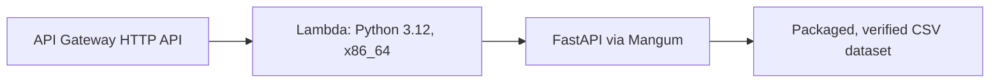

# Ownership Scanner

Ownership Scanner is a feasibility-stage project for testing whether product-to-company ownership can be modeled and verified reliably. It includes a local, read-only API over the canonical CSV dataset.

The development API was deployed on August 6, 2026:

- API: <https://83fwv16l3j.execute-api.us-east-1.amazonaws.com>
- Interactive documentation: <https://83fwv16l3j.execute-api.us-east-1.amazonaws.com/docs>
- OpenAPI schema: <https://83fwv16l3j.execute-api.us-east-1.amazonaws.com/openapi.json>

This is a development deployment, not a production service.

This repository currently contains:

- CSV templates for products, brands, companies, ownership relationships, and sources
- A standard-library Python validator
- Automated validator tests
- A framework-independent ownership traversal service
- A local FastAPI HTTP interface
- MVP, data-model, and manual-research documentation

The feasibility dataset now contains 13 real, manually researched products with sourced ownership chains.

## Install

Requires Python 3.9 or newer.

```bash
python3 -m venv .venv
source .venv/bin/activate
python -m pip install --upgrade pip
python -m pip install -r requirements.lock
python -m pip install --no-build-isolation --no-deps -e .
```

## Validate and test

```bash
python3 scripts/validate_data.py --profile development
python3 scripts/validate_data.py --profile full
python -m pytest
```

Both the development and full feasibility profiles pass with the researched product set. The tests are expected to pass.
The complete test suite currently contains 45 passing tests.

## Start the local API

```bash
python -m uvicorn ownership_scanner.api:app --reload
```

Open the interactive OpenAPI documentation at <http://127.0.0.1:8000/docs>.

Example product lookup (the quotes preserve the GTIN as text in the shell):

```bash
curl "http://127.0.0.1:8000/products/00016000124790"
```

## Development deployment

The deployed development architecture is:



The API uses payload format 2.0. The Lambda handler is:

```text
ownership_scanner.lambda_handler.handler
```

Mangum wraps the existing FastAPI application. The app, CSV repository, service,
and handler are initialized once at module import so a warm Lambda environment
can reuse them. Uvicorn remains a local-development dependency and is not
started or packaged for Lambda.

Canonical data is discovered in this order:

1. `OWNERSHIP_DATA_DIR`, when explicitly set
2. the packaged `data/` directory beside the deployed application package
3. the repository-root `data/` directory during local development

The selected directory must contain all nine required CSV files. Startup fails
if the configured or discovered dataset is missing or incomplete.

### Build and verify the Lambda artifact

The builder downloads CPython 3.12 manylinux x86_64 wheels directly into an
isolated staging directory. It never copies packages from the local virtual
environment, which makes it safe to run from an Apple Silicon Mac.

```bash
python scripts/build_lambda_artifact.py
python scripts/verify_lambda_artifact.py
```

The output is `dist/ownership-scanner-lambda.zip`. The verifier lists the ZIP,
checks all nine CSVs and required packages, rejects tests, documentation,
virtual environments, caches, local-only dependencies, likely secrets, intake
photos, and absolute Mac paths, validates Linux x86_64 binary extensions, imports
the packaged handler code, and reports compressed and uncompressed sizes.

Terraform configurations under `infra/` manage the development API, Lambda,
least-privilege IAM, 14-day logging, four alarms, a $5 monthly budget monitor,
and remote state. API throttling is five requests per second with a burst of
ten. See [infra/README.md](infra/README.md) for rebuild and deployment-update
instructions.

## Known limitations

- The product catalog is limited to 13 manually researched products.
- There is no frontend or authentication.
- CSV updates require rebuilding and redeploying the Lambda artifact.
- Ownership results may include explicitly identified research gaps.

See [docs/manual-research-guide.md](docs/manual-research-guide.md) for the exact research workflow.
